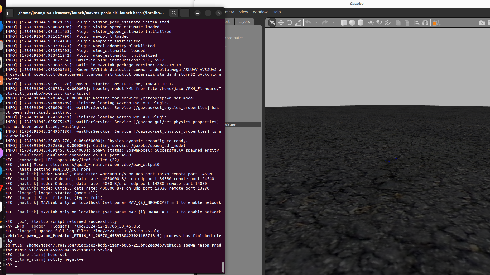
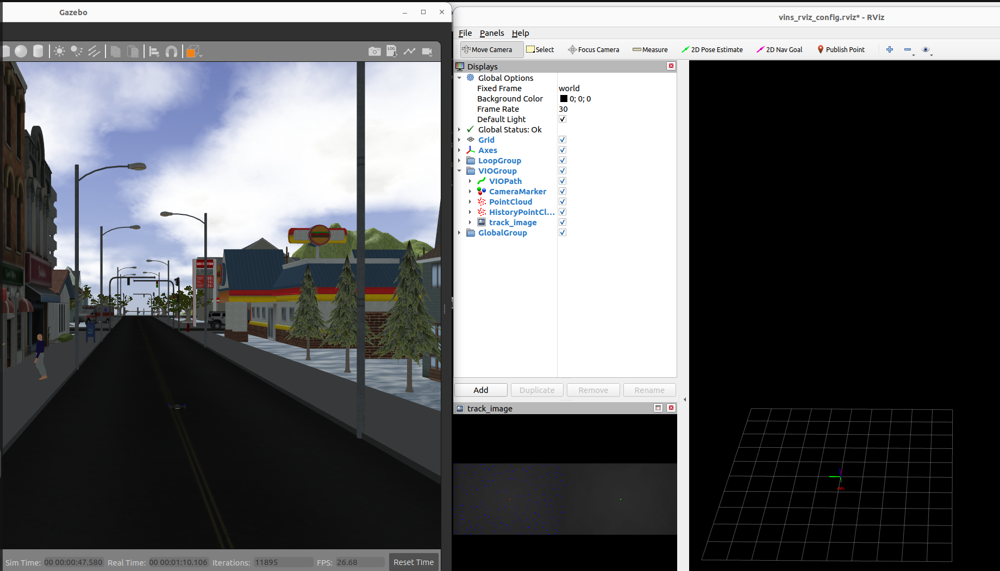
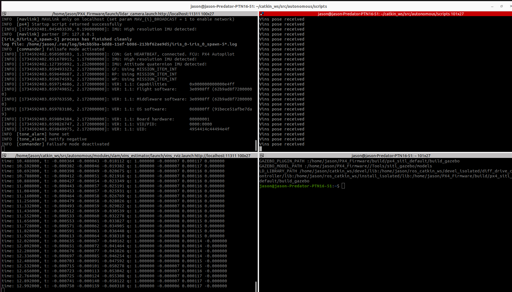
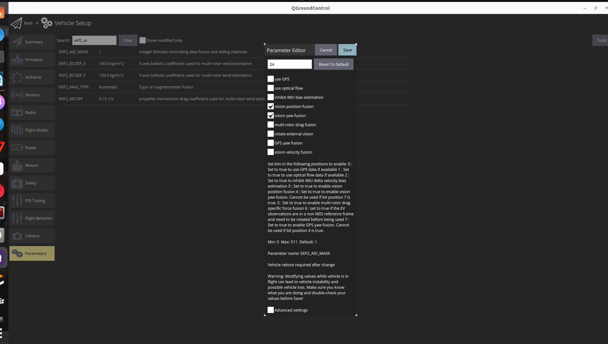
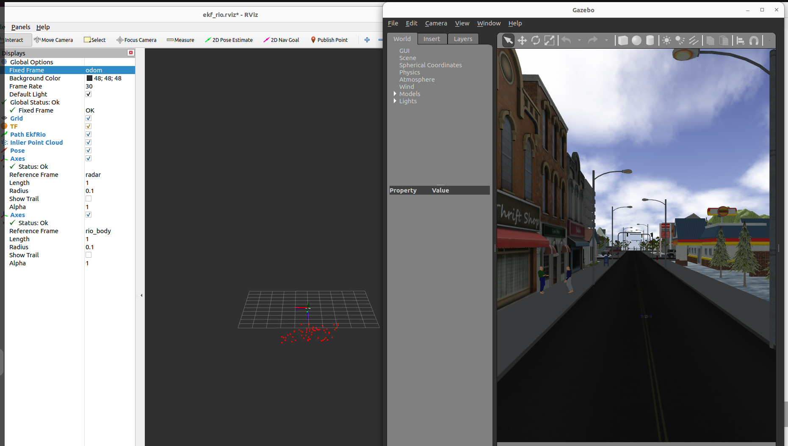
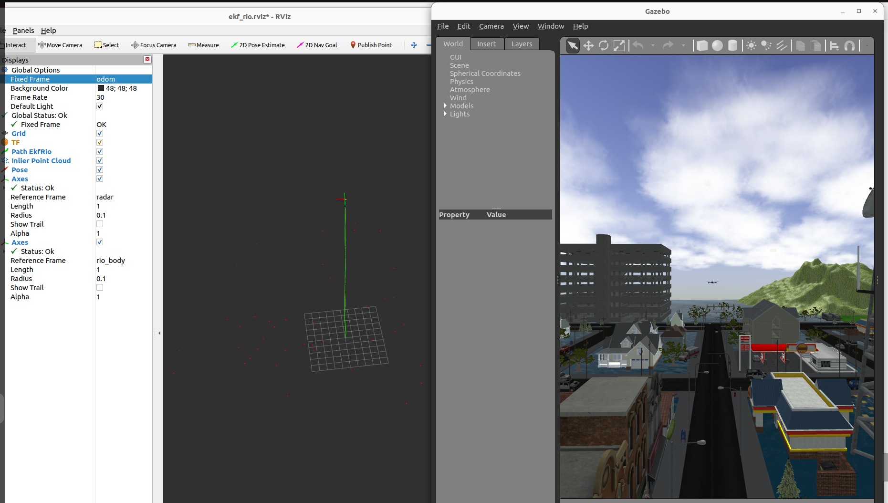
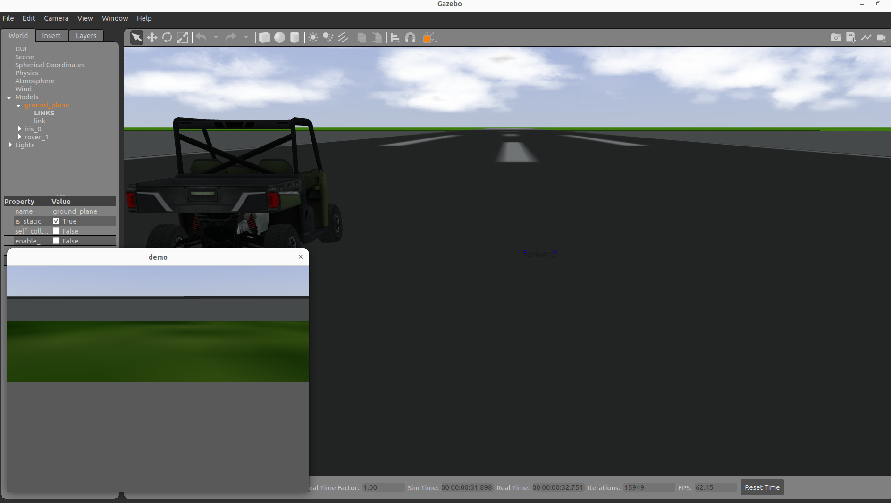
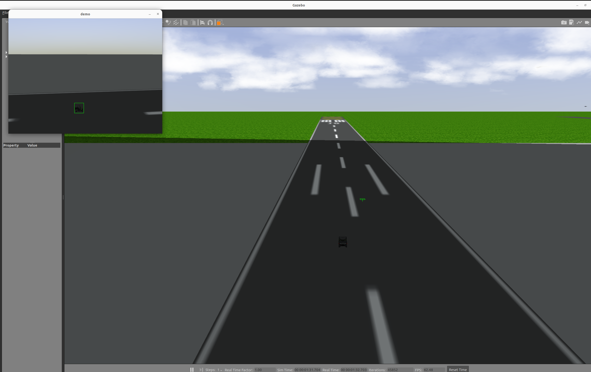

Simulation Guide

## 1. install

### 1.1 ROS1 install (Ubuntu 22.04)

 This is a step-by--step guide to install and build all the prerquisties for running the  simulation on Ubuntu 22.04 with ROS noetic(include Gazebo 11)

 You might want to skip some steps if your system is already partially installed.

 Note: If you are a Ubuntu 20.04 system, please refer to the project_partice documentation to update the ros1 system

#### Add ros GPG key

```bash
sudo apt update && sudo apt install curl -y
sudo curl -sSL https://raw.githubusercontent.com/ros/rosdistro/master/ros.key -o /usr/share/keyrings/ros-archive-keyring.gpg
```

#### Add official warehouse

```bash
echo "deb [arch=$(dpkg --print-architecture) signed-by=/usr/share/keyrings/ros-archive-keyring.gpg] http://packages.ros.org/ros2/ubuntu $(. /etc/os-release && echo $UBUNTU_CODENAME) main" | sudo tee /etc/apt/sources.list.d/ros2.list > /dev/null
```

#### 安装引导程序依赖项

Mainly a series of tools for source code installation, such as rosdep and vcstools.

```bash
sudo apt-get install python3-rosdep2 python3-rosinstall-generator python3-vcstools python3-vcstool build-essential
```

Initialize rosdep.

```bash
sudo rosdep init
```

#### Install hddtemp

```bash
cd ~/Downloads
wget http://archive.ubuntu.com/ubuntu/pool/universe/h/hddtemp/hddtemp_0.3-beta15-53_amd64.deb
sudo apt install ~/Downloads/hddtemp_0.3-beta15-53_amd64.deb
```

#### Modify rosdep initialization file

Download the base.yaml file.

```bash
d ~/Downloads
wget https://raw.githubusercontent.com/ros/rosdistro/master/rosdep/base.yaml
```

Open the base.yaml file, and ubuntu22 can be modified using GEDIT.

```bash
gedit ~/Downloads/base.yaml
```

Search hddtemp and add ubuntu22 (the last line, the line of Jimmy) in the Ubuntu section, as shown below:

```yaml
hddtemp:
  arch: [hddtemp]
  debian: [hddtemp]
  fedora: [hddtemp]
  freebsd: [python27]
  gentoo: [app-admin/hddtemp]
  macports: [python27]
  nixos: [hddtemp]
  openembedded: [hddtemp@meta-oe]
  opensuse: [hddtemp]
  rhel: [hddtemp]
  slackware: [hddtemp]
  ubuntu:
    '*': null
    bionic: [hddtemp]
    focal: [hddtemp]
    jammy: [hddtemp]
```

#### Modify the contents of 20-default.list file

Modify the contents of the 20-default.list file created by 'rosdep init' to read the * * local base.yaml file * *.

```bash
sudo gedit /etc/ros/rosdep/sources.list.d/20-default.list
```

Amend to read as follows:

```yaml
# os-specific listings first
yaml https://raw.githubusercontent.com/ros/rosdistro/master/rosdep/osx-homebrew.yaml osx

# generic
# yaml https://raw.githubusercontent.com/ros/rosdistro/master/rosdep/base.yaml
yaml file:///home/your_username/Downloads/base.yaml
yaml https://raw.githubusercontent.com/ros/rosdistro/master/rosdep/python.yaml
yaml https://raw.githubusercontent.com/ros/rosdistro/master/rosdep/ruby.yaml
gbpdistro https://raw.githubusercontent.com/ros/rosdistro/master/releases/fuerte.yaml fuerte

# newer distributions (Groovy, Hydro, ...) must not be listed anymore, they are being fetched from the rosdistro index.yaml instead
```

#### 更新rosdep

```bash
rosdep update
```

It may take some time (you need to connect to GitHub). You can consider modifying the hosts file or other methods to help you connect to GitHub. Please refer to them for details.

#### 正式安装

#### 创建catkin工作区

It is mainly used to store the source code workspace for installing ROS.

```bash
mkdir ~/ros_catkin_ws
cd ~/ros_catkin_ws
```

Install the desktop full version, which is more comprehensive. The code is as follows:

```bash
rosinstall_generator desktop_full --rosdistro noetic --deps --tar > noetic-desktop.rosinstall
mkdir ./src
vcs import --input noetic-desktop.rosinstall ./src
```

#### 解决依赖问题

The installation of the ROS package may depend on each other. If there is no system dependency, it cannot be used. You need to use the rosdep tool to automatically detect and install the corresponding [dependent files](https://zhida.zhihu.com/search?content_id=241111139&content_type=Article&match_order=1&q=依赖文件&zhida_source=entity)

。  

```bash
rosdep install --from-paths ./src --ignore-packages-from-source --rosdistro noetic -y
```

#### 解决兼容问题

Before building ros1 noetic, we need to manually patch two packages in SRC folder to be compatible with ubuntu22.04:

- rosconsole：ROS console logging application
- urdf：Parser of unified Robot Description Format (URDF) file

The related patches are open source implemented on GitHub, the author[Daniel Reuter](https://link.zhihu.com/?target=https%3A//github.com/dreuter)reference link:

- [GitHub — dreuter/rosconsole](https://link.zhihu.com/?target=https%3A//github.com/dreuter/rosconsole/tree/noetic-jammy)
- [GitHub — dreuter/urdf](https://link.zhihu.com/?target=https%3A//github.com/dreuter/urdf/tree/set-cxx-version)

Use the modified package on GitHub to directly replace the original source package.  

```bash
cd ~/ros_catkin_ws

# Download and use fix branch
git clone https://github.com/dreuter/rosconsole.git
cd rosconsole
git checkout noetic-jammy
cd ..
cp rosconsole ./src -rf

git clone https://github.com/dreuter/urdf.git
cd urdf
git checkout set-cxx-version
cd ..
cp urdf ./src -rf
```

#### Build ros1 noetic

Use 'catkin_make_isolated' command to build ros1 noetic and install

```bash
./src/catkin/bin/catkin_make_isolated --install -DCMAKE_BUILD_TYPE=Release
```

Ros1 will be automatically installed in the install_isolated folder in the set catkin workspace. After updating, ros1 can be used normally!

```bash
source ~/ros_catkin_ws/install_isolated/setup.bash
```

You can directly write the source command to bashrc to avoid updating every time you use it.

#### 其他

The installed version of ros1 desktop full does not fully include the required ROS packages, which may need to be installed separately. For example, octomap, mavros, and so on. The installation method under ubuntu20 is:

```bash
sudo apt install ros-noetic-octomap ros-noetic-mavros
```

when installing ros1 from the source code, the corresponding package also needs to be installed from the source code. The process is as follows.

#### Generate package files and automatically download dependencies

```bash
cd ~/ros_catkin_ws
rosinstall_generator package1 package2 --rosdistro noetic --deps --tar > noetic-packages.rosinstall
vcs import --input noetic-packages.rosinstall ./src
```

The location of Package1 and package2 can be replaced by the packages that need to be installed. Note that there is no need to add ROS noetic- content. You can also continue to put more packages in the back for one-time installation, but it is safer to install them separately (because of the GitHub connection problem, the way VCS downloads packages will cause that all dependencies must be downloaded correctly to compile normally).

Even if the first download of dependency a succeeds and dependency B fails, the second download of dependency B succeeds and dependency a fails. Combined, it seems that both a and B succeed, but in fact, at the beginning of the second download, the VCs tool will delete all dependencies. Therefore, all downloads must be successful.

Take mavros for example, the installation method is:

```bash
cd ~/ros_catkin_ws
rosinstall_generator mavros --rosdistro noetic --deps --tar > noetic-packages.rosinstall
vcs import --input noetic-packages.rosinstall ./src
```

#### 替换rosconsole和urdf

The newly generated package file may have dependencies on rosconsole and URDF. Please refer to the section on solving dependency problems in this article for replacement.

#### 安装

```bash
./src/catkin/bin/catkin_make_isolated --install -DCMAKE_BUILD_TYPE=Release
source ~/ros_catkin_ws/install_isolated/setup.bash
```
When compiling mavros, an error is reported and the future package is missing. You need to manually install PIP install future

### 1.2  Autopilot install

To get the *very latest* (`demo_sitl` branch) version onto your computer, enter the following command into a terminal:

```
git clone git@github.com:Autonomy2024/PX4_Firmware.git
cd PX4_Firmware
git checout demo_sitl
git submodule update --init --recursive
```

update gazebo and arm-gcc

```
./Tools/setup/ubuntu.sh
```

update xmlstarlet:

```
sudo apt install xmlstarlet
```

Now we  use Gazebo Classic on Ubuntu 22.04, so  you  can use the following commands to remove [Gazebo](https://docs.px4.io/main/en/sim_gazebo_gz/) (Harmonic) and then reinstall Gazebo-Classic 11:

```
sudo apt remove gz-harmonic
sudo apt install aptitude
sudo aptitude install gazebo libgazebo11 libgazebo-dev
```

running the simulatuion:

```
cd /path/to/PX4_Firmware
make px4_sitl gazebo
```

If you run success, Now you can see :


### 1.3 Mavros install

Download and compile mavros:

```
mkdir -p ~/catkin_ws/src
cd ~/catkin_ws/src
git clone git@github.com:Autonomy2024/autonomous.git
cd autonomous
git submodule update --init --recursive
```

Install libgeographic and geographiclib

```
sudo apt-get install libgeographic-dev
sudo apt-get install geographiclib-tools
```

install geographiclib datasets:

```
cd ~/catkin_ws/src/autonomous/driver/mavros/mavros/scripts/
sudo ./install_geographiclib_datasets.sh
```


Because the order in which Gazebo looks for models is to search in .gazebo/models/ first, and then search in other paths, so when copying models to PX4 SITL, pay attention to whether there is a file with the same name under .gazebo/models/ (such as  stereo_camera) , if any, either delete the file with the same name, or replace the file with the same name.

#### 1.4 Update some gazebo models

Unzip models.zip to ~/.gazebo, Now you can see many gazebo models in ~/.gazebo/models/

Note:

You need to remove the stereo_camera 3d_lidar in  ~/.gazebo/models/

```
cd ~/.gazebo/models/
rm -r stereo_camera/ 3d_lidar/ 3d_gpu_lidar/ hokuyo_lidar/
```


#### 1.5 VIO tools update

update nvidia-cuda:

```
sudo apt install nvidia-cuda-toolkit
```

Add these line to your ~/.bashrc and reload the terminal.

```
# cuda 10.2
export CUDA_HOME=/usr/local/cuda
export LD_LIBRARY_PATH=$LD_LIBRARY_PATH:/usr/local/cuda/lib64:/usr/local/cuda/extras/CUPTI/lib64
export PATH=$PATH:$CUDA_HOME/bin
```

update ceres-solver:

```
sudo apt install libgoogle-glog-dev
sudo apt-get install libsuitesparse-dev
git clone --recurse-submodules https://github.com/ceres-solver/ceres-solver
git checkout 1.14.0
mdkir build
cd build
cmake ..
make
sudo make install
```

#### 1.6 update ground station(QroundControl)

 Download QGroundControl.AppImage from this link: https://github.com/mavlink/qgroundcontrol/releases

and then give executable permissions

```
chmod +x  QGroundControl.AppImage
./QGroundControl,AppImage
```

#### 1.7 compile and running autonomous 

compile autonomous project:

```
sudo apt install python3-pip python3-rosdep python3-catkin-pkg python3-rospkg
sudo apt install python3-pip
sudo pip3 install catkin-tools
cd ~/catkin_ws/
catkin_make or catkin build
```

Add this source to ~/.bashrc

```
gedit ~/.bashrc
# Add this source in .bashrc
source ~/catkin_ws/devel/setup.bash
source ~/PX4_Firmware/Tools/setup_gazebo.bash ~/PX4_Firmware/ ~/PX4_Firmware/build/px4_sitl_default
export ROS_PACKAGE_PATH=$ROS_PACKAGE_PATH:~/PX4_Firmware
export ROS_PACKAGE_PATH=$ROS_PACKAGE_PATH:~/PX4_Firmware/Tools/sitl_gazebo
```

running test:

```
source ~/.bashrc
roslaunch px4 mavros_posix_sitl.launch
```



#### 1.8 running VIO:

running flight control sim:

```
roslaunch px4 lidar_camera.launch
```

open a new terminal, running vio:

```
bash ~/catkin_ws/src/autonomous/scripts/drone_run_vio.sh
```



open a new terminal, transfer vio data to mavros and fcs:

```
cd ~/catkin_ws/src/autonomous/scripts
python3 vins_transfer.py iris 0
```



disable fuse gps, use qgroundcontrol set param ekf2_aid_mask to 24



And also need to set param:

MPC_VEL_MANUAL 10

EKF2_EVP_NOISE 0.3

EKF2_EVV_NOISE 0.1

Now you can use virtual joystick or Xbox360 joystick to arm and fly the drone.

You can see the display of the aircraft’s trajectory in rviz


#### 1.9 running Radar inertial odometery (RIO)

running flight control sim:

```
roslaunch px4 lidar_camera.launch
```

running rio

```
bash ~/catkin_ws/src/autonomous/scripts/run_rio.sh
```



disable fuse gps, use qgroundcontrol set param ekf2_aid_mask to 256


And also need to set param:

MPC_VEL_MANUAL 5

EKF2_EVP_NOISE 0.8

EKF2_EVV_NOISE 0.5

Now you can use virtual joystick or Xbox360 joystick to arm and fly the drone.

You can see the display of the drone’s trajectory in rviz



### 1.10  running terminal guidance practice

This is an exercise simulating the terminal guidance of FPV UAV. The UAV has no position
information, and only have a fixed camera and IMU, Baro sensor.

This summary mainly focuses on the simulation practice of a drone attack a car. The result of
running this practice is that the environment settings above have been completed by default.

Connect your Xbox360 remote control handle to the computer before starting verification

compile and running:
open a new ternimal:

```
cd ~/catkin_ws/
catkin_make or catkin build
cd ~/catkin_ws/src/autonomous/scripts
bash running_attack.sh
```



drone armming:
open a new ternimal:

```
rosservice call /iris_0/mavros/cmd/arming "value: true"
```

It can fly freely to ensure that the vehicle can be seen in the UAV video screen, then select the
target vehicle with the mouse box, press the space bar, and start image tracking

<div align="center">
    
</div>

Finally, press button A on the remote control to start automatic attack.
